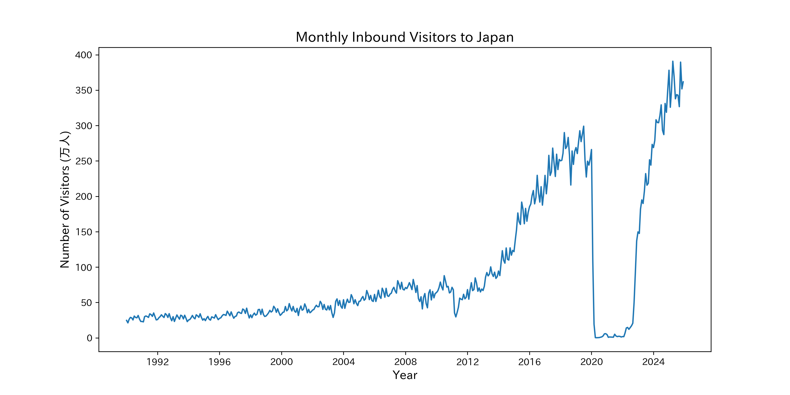
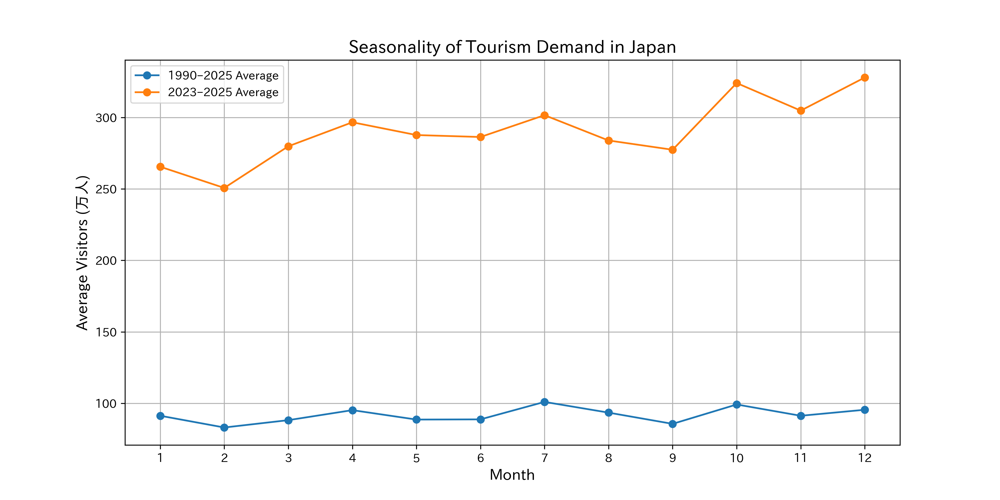
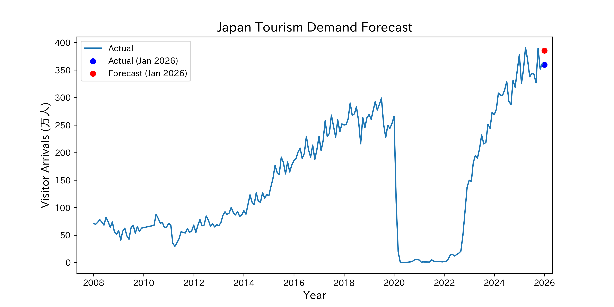
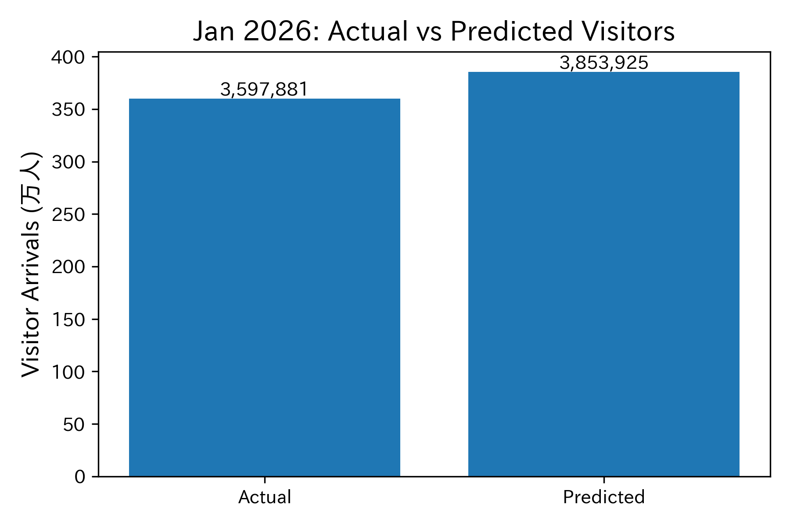

# Tourism Demand Forecast for Japan
### Forecasting inbound tourism demand using macroeconomic indicators and search trends

## Overview
This project analyzes and forecasts monthly inbound tourism demand to Japan using a time-series model.

## Data Sources
### 1. JNTO (Foreign Visitors to Japan, Tourism Consumption)
##### (Access to the JNTO website may be restricted if you open it directly from GitHub)
Monthly data on the number of foreign visitors to Japan (JNTO), covering the period from 1990 to 2025.
- Dataset: japan_inbound_visitors_monthly.csv
- Time span: 1990 to 2025 + 2026-01
- Frequency: Monthly
- Source: https://statistics.jnto.go.jp/graph/#graph--inbound--travelers--transition

### 2. FRED of St.Louis
USD/JPY Exchange Rate (DEXJPUS).
- Time span: 1971-01-04 to 2026-04-24
- Frequency: Daily
- Source: https://fred.stlouisfed.org/graph/fredgraph.csv?id=DEXJPUS

### 3. BIS (Bank for International Settlements) Data Portal
Real Effective Exchange Rate (REER) for Japan.
- Dataset: BIS_REER_Japan.csv
- Time span: 1964-01 to 2026-03
- Frequency: Monthly
- Source: https://data.bis.org/topics/EER/BIS,WS_EER,1.0/M.R.N.JP

### 4. Google Trends
This dataset contains monthly Google Trends search interest indices from January 2004 to April 2026 for travel-related keywords, including “Japan Travel”, “France Travel”, “Spain Travel”, “America Travel”, and “World Travel”. These indices (scaled from 0 to 100) reflect relative search popularity over time and serve as a proxy for global tourism interest and travel demand.
- Dataset: google_trends.csv
- Time span: 2004-01 to 2026-04
- Frequency: Monthly
- Source: https://trends.google.co.jp/trends/

### 5. Japan Tourism Agency (観光庁)
This dataset is based on the official `Lodging Travel Statistics` published by the Japan Tourism Agency (JTA).  
It covers approximately 18 years of monthly data from January 2007 to December 2025, providing a long-term view of accommodation demand in Japan.

- Dataset: Excel Data
- Time span: 2007-01 to 2025-12
- Frequency: Monthly
- Source: https://www.mlit.go.jp/kankocho/tokei_hakusyo/shukuhakutokei.html

The dataset includes the following key indicators:

- **Total Guest Nights (`total_guest_nights`)**  
  Total number of guest nights (both domestic and international)

- **Foreign Guest Nights (`foreign_guest_nights`)**  
  Number of guest nights by international visitors (inbound tourism demand)

## Visualization
### Foreign Visitors Arrivals

Growth was gradual from the 1990s through the early 2010s, but has accelerated since 2013.  
After a sharp decline in 2020 due to the COVID-19 pandemic, growth has recovered rapidly since 2023 and is currently approaching record highs.

### Seasonal Pattern of Foreign Visitor Arrivals
.png)
Monthly Average Number of Foreign Visitors to Japan (in 10,000) from 1990 to 2025: Visualization of Seasonal Patterns

July sees the highest numbers (approximately 1.01 million), October remains at a high level (approximately 990,000), and April is also relatively high (approximately 950,000). In contrast, February has the lowest numbers (approximately 820,000).

Comparing Seasonal Patterns in Inbound Visitor Numbers: “1990–2025 Average” vs. “2023–2025 Average”

・February is low
・April, July, and October are high

This pattern is consistent across both periods

・In the 2023–2025 period, “October and December” have become significantly stronger
・The level of international visitor arrivals to Japan in the 2023–2025 period has increased by approximately 2.5 to 3 times

### Visitor Arrivals vs USD/JPY (2012-2025, Excluding COVID period)
.png)

### Japan Tourism Demand Forecast

## Conclusion

